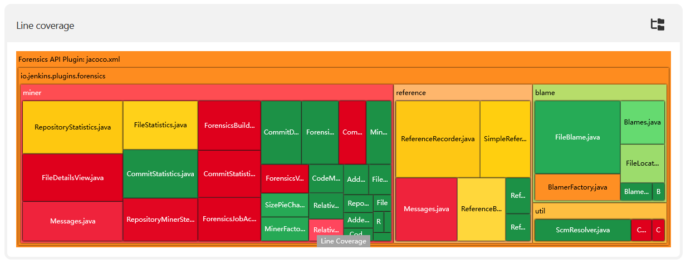

# Jenkins Code Coverage Plug-in

[](https://gitter.im/jenkinsci/code-coverage-api-plugin?utm_source=badge&utm_medium=badge&utm_campaign=pr-badge)
[](https://plugins.jenkins.io/code-coverage-api)
[](https://ci.jenkins.io/job/Plugins/job/code-coverage-api-plugin/job/master/)
[](https://github.com/jenkinsci/code-coverage-api-plugin/actions)
[](https://codecov.io/gh/jenkinsci/code-coverage-api-plugin/branch/master)
[](https://github.com/jenkinsci/code-coverage-api/actions/workflows/codeql.yml)

The Jenkins code coverage plug-in collects reports of code coverage or mutation coverage tools. It has support for the following report formats:

- [JaCoCo](https://www.jacoco.org/jacoco)
- [Cobertura](https://cobertura.github.io/cobertura/)
- [PIT](https://pitest.org/)

If your coverage tool is not yet supported by the code coverage plugin you can provide a pull request for the [Coverage Model](https://github.com/uhafner/coverage-model/pulls).

The plugin publishes a report of the code coverage and mutation coverage in your build, so you can navigate to a summary report from the main build page. From there you can also dive into the details:
- tree charts that show the distribution of coverage by type (line, instruction, branch, method, class, etc.)
- tabular listing of all files with their coverage 
- source code of the files with the coverage highlighted
- trend charts of the coverage over time

This project was part of [GSoC 2018](https://jenkins.io/projects/gsoc/2018/code-coverage-api-plugin/).

## Features

The code coverage plug-in provides the following features when added as a post build action (or step)
to a job:

* **Coverage analysis of projects and pull requests:**
  * all project code (Project Coverage)
  * code changes (Modified Lines or Files Coverage)
  * coverage changes created by changed test cases (Indirect Coverage Changes)
* **Modernized coverage report visualization:**
  * Coverage overview and trend

    
  
  * Colored project coverage tree map for line and branch coverage

    
  
  * Source code navigation

    
  
  * Specific source code view for specifically analyzing the coverage of code changes (Change Coverage):

    
   
  * Specific source code view for specifically analyzing the coverage after test changes (Indirect Coverage Changes):

    

* **Customizable coverage overview for the Jenkins dashboard view and for build results:**
  
  

## Usage

:exclamation: The plugin does not run the code coverage, it just visualizes the results reported by such tools.
You still need to enable and configure the code coverage tool in your build file or Jenkinsfile.

### Supported project types

The Warnings Next Generation plugin supports the following Jenkins project types:

- Freestyle Project
- Maven Project
- Scripted Pipeline (sequential and parallel steps)
- Declarative Pipeline (sequential and parallel steps)
- Multi-branch Pipeline

### Freestyle project 

Enable the "Record code coverage results" publisher in the Post-build Actions section of your job. Select at least one coverage tool and specify the path to the report file. If you do not specify a path, the plugin will search for the report file in the workspace using the default pattern of the tool.

The plugin can compare the coverage results of the current build with the results of a reference build. The reference build will be discovered using the [forensics-api](https://github.com/jenkinsci/forensics-api-plugin) plugin.

### Pipeline example

We also support pipeline configuration, you can generate pipeline code in Jenkins' Snippet Generator.

```groovy

recordCoverage(tools: [[parser: 'JACOCO']],
        id: 'jacoco', name: 'JaCoCo Coverage',
        sourceCodeRetention: 'EVERY_BUILD',
        qualityGates: [
                [threshold: 60.0, metric: 'LINE', baseline: 'PROJECT', unstable: true],
                [threshold: 60.0, metric: 'BRANCH', baseline: 'PROJECT', unstable: true]])

```

## Remote API

We provide a remote API to retrieve coverage data, using the following URL: `https://[jenkins-url]/job/[job-name]/[build-number]/coverage/api/json?pretty=true`. 

Example output:
```json
{
  "_class" : "io.jenkins.plugins.coverage.metrics.steps.CoverageApi",
  "modifiedFilesDelta" : {
    "branch" : "+1.72%",
    "class" : "-3.54%",
    "complexity" : "-236",
    "complexity-density" : "+0.47%",
    "file" : "+0.00%",
    "instruction" : "+0.16%",
    "line" : "-0.48%",
    "loc" : "-482",
    "method" : "+1.23%",
    "module" : "+0.00%",
    "package" : "+0.00%"
  },
  "modifiedFilesStatistics" : {
    "branch" : "83.91%",
    "class" : "93.33%",
    "complexity" : "392",
    "complexity-density" : "+50.19%",
    "file" : "100.00%",
    "instruction" : "88.19%",
    "line" : "87.96%",
    "loc" : "781",
    "method" : "86.18%",
    "module" : "100.00%",
    "package" : "100.00%"
  },
  "modifiedLinesDelta" : {
    "branch" : "+8.95%",
    "file" : "+0.00%",
    "line" : "+3.85%",
    "loc" : "-610",
    "module" : "+0.00%",
    "package" : "+0.00%"
  },
  "modifiedLinesStatistics" : {
    "branch" : "92.86%",
    "file" : "100.00%",
    "line" : "91.81%",
    "loc" : "171",
    "module" : "100.00%",
    "package" : "100.00%"
  },
  "projectDelta" : {
    "branch" : "+4.43%",
    "class" : "+2.94%",
    "complexity" : "-8",
    "complexity-density" : "+1.28%",
    "file" : "+4.00%",
    "instruction" : "+2.59%",
    "line" : "+3.37%",
    "loc" : "-50",
    "method" : "+1.28%",
    "module" : "+0.00%",
    "package" : "+0.00%"
  },
  "projectStatistics" : {
    "branch" : "82.19%",
    "class" : "96.88%",
    "complexity" : "628",
    "complexity-density" : "+49.72%",
    "file" : "100.00%",
    "instruction" : "88.03%",
    "line" : "88.44%",
    "loc" : "1263",
    "method" : "84.94%",
    "module" : "100.00%",
    "package" : "100.00%"
  },
  "qualityGates" : {
    "overallResult" : "SUCCESS",
    "resultItems" : [
      {
        "qualityGate" : "Overall project - Line Coverage",
        "result" : "SUCCESS",
        "threshold" : 60.0,
        "value" : "88.44%"
      },
      {
        "qualityGate" : "Overall project - Branch Coverage",
        "result" : "SUCCESS",
        "threshold" : 60.0,
        "value" : "82.19%"
      }
    ]
  },
  "referenceBuild" : "<a href=\"http://localhost:8080/job/coverage-model-history/10/\" class=\"model-link inside\">coverage-model-history #10</a>"
}
```
